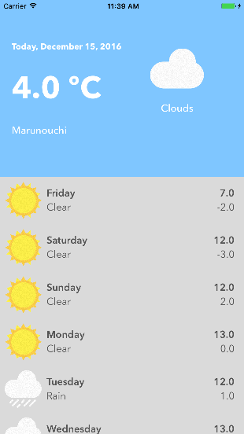

# Rainy Shiny Cloudy

Based on Udemy's course [“iOS 10 & Swift 3: From Beginner to Paid Professional”](https://www.udemy.com/devslopes-ios10/learn/v4/t/lecture/5828348)

A weather app:

- Custom cells.
- CoreLocation.
- Data pulled from public API, parsed into JSON.
- CocoaPods for HTTP requests (Alamofire)
- Singleton for Shared Instances.

