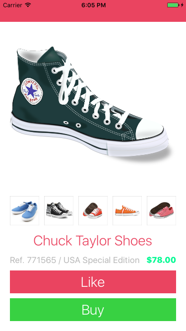
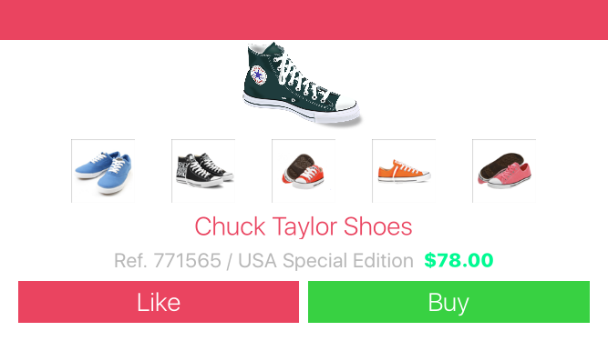

# Stackada Stack

Based on Udemy's course [“iOS 10 & Swift 3: From Beginner to Paid Professional”](https://www.udemy.com/devslopes-ios10/learn/v4/t/lecture/5428772)

Simple UI to learn Stackviews:

- Horizontal and vertical Stackviews.
- Variations of Stackview orientations for portrait and landscape devices.
- Content hugging priority and Content compression resistance priority instead of constraints for buttons.

